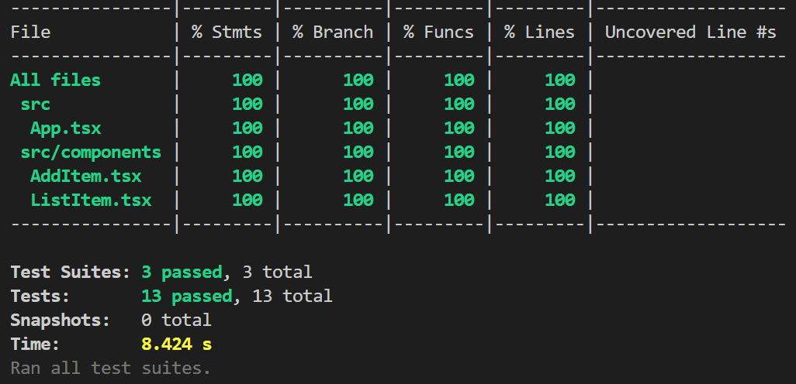

# 🛒 Shopping List – Mayden Coding Challenge

**Tech stack:** React + TypeScript  
**Time spent:** 6 hours  
**Focus:** Well-structured, secure, and clean code with comprehensive testing

## ✅ Stories Implemented

1. View a list of items on the shopping list
2. Add new items to the shopping list
3. Remove items from the shopping list
4. Cross off completed items
5. Persist the shopping list across browser refreshes via local storage

## 🧪 Testing

- Implemented a mix of unit and integration tests using React Testing Library and Jest covering core functionality including:
    - Adding, removing, and toggling items
    - Persistence logic
    - UI state for empty and populated lists

### Coverage Report:

## 🚀 How to Run
1. Clone the repository:
    - `git clone <repository-url>`
    - `cd SnackTrack`

2. Install dependencies:
    - `npm install`

3. Start the development server:
    - `npm run dev`

4. Open your browser and go to http://localhost:5173

## 🧩 How to Test

1. Run the test suite:
    - `npm run test`
